# tfmermaid-action

This Github Action converts your output of [Terraform graph](https://www.terraform.io/cli/commands/graph) to [Mermaid's syntax](https://mermaid-js.github.io/mermaid/).

## Usage

See [action.yml](action.yml)

### .github/workflows/tfmermaid.yml

Convert the output of `terraform graph` to Mermaid's syntax and embed it in the `README.md` file.

```yaml
- uses: actions/checkout@v3
- uses: asannou/tfmermaid-action@v1
  with:
    file: README.md
- name: commit
  run: |
    git add README.md
    if ! git diff --cached --quiet --exit-code
    then
      git config user.name "github-actions[bot]"
      git config user.email "github-actions[bot]@users.noreply.github.com"
      git commit -m "generated"
      git push
    fi
```

### README.md

The converted output is embedded inside the mermaid code block commented `%%tfmermaid`.

~~~
```mermaid
%%tfmermaid
```
~~~

## Examples

### [terraform-provider-aws/examples/two-tier](https://github.com/hashicorp/terraform-provider-aws/tree/main/examples/two-tier)

#### Before

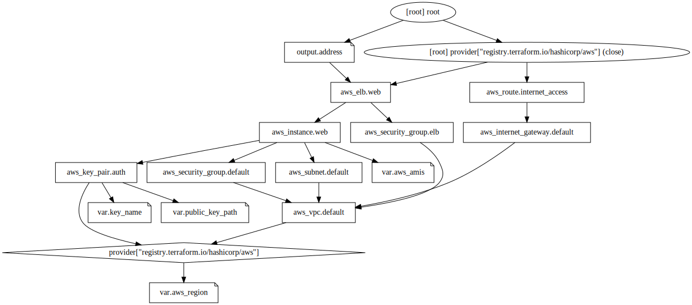

#### After

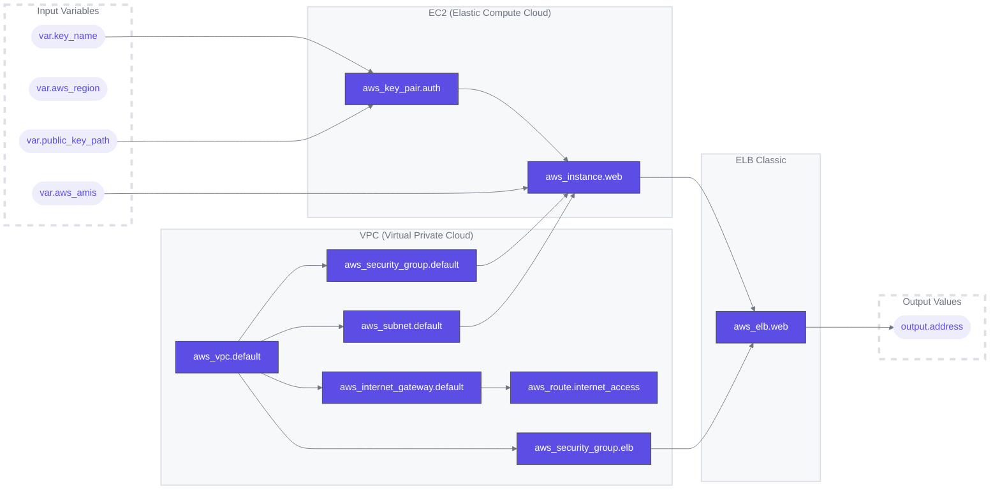

### [terraform-provider-aws/examples/ecs-alb](https://github.com/hashicorp/terraform-provider-aws/tree/main/examples/ecs-alb)

```yaml
- uses: asannou/tfmermaid-action@v1
  with:
    exclude: var,output
```

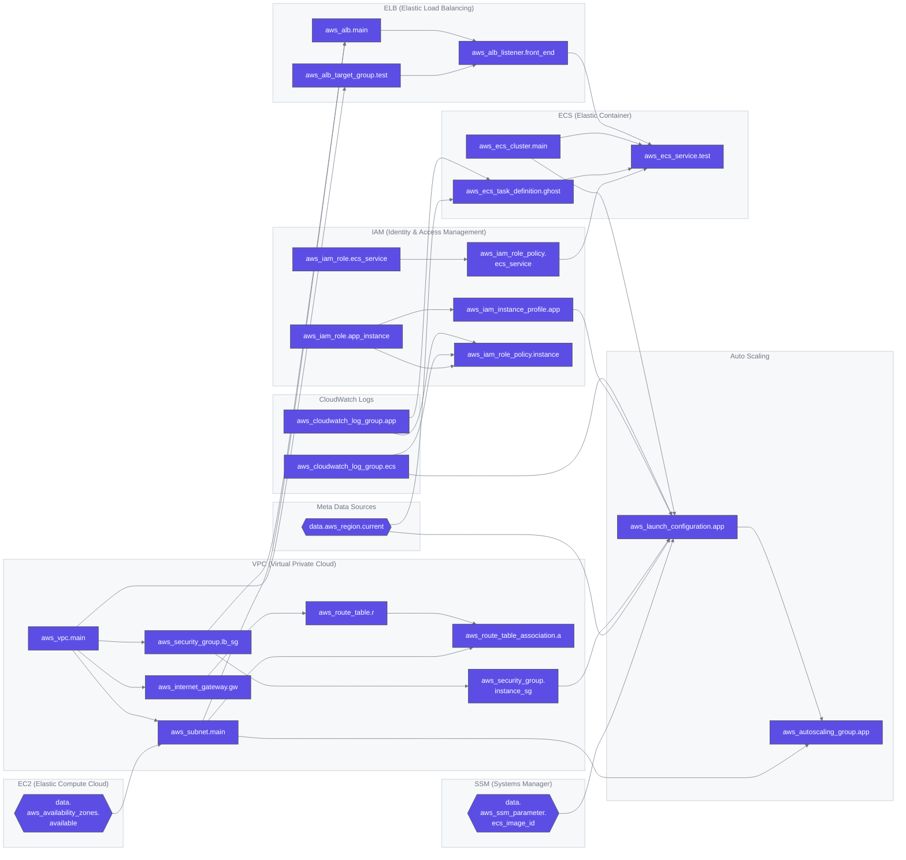

### [terraform-provider-aws/examples/events/kinesis](https://github.com/hashicorp/terraform-provider-aws/tree/main/examples/events/kinesis)

```yaml
- uses: asannou/tfmermaid-action@v1
  with:
    orientation: RL
    arrow-direction: forward
    exclude: _orphan
```

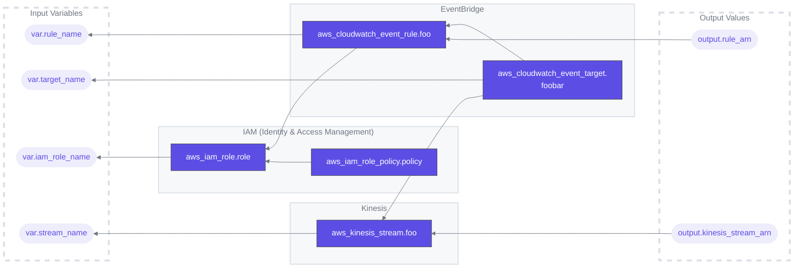

### [terraform-provider-aws/examples/lambda-file-systems](https://github.com/hashicorp/terraform-provider-aws/tree/main/examples/lambda-file-systems)

```yaml
- uses: asannou/tfmermaid-action@v1
  with:
    exclude: _orphan
```

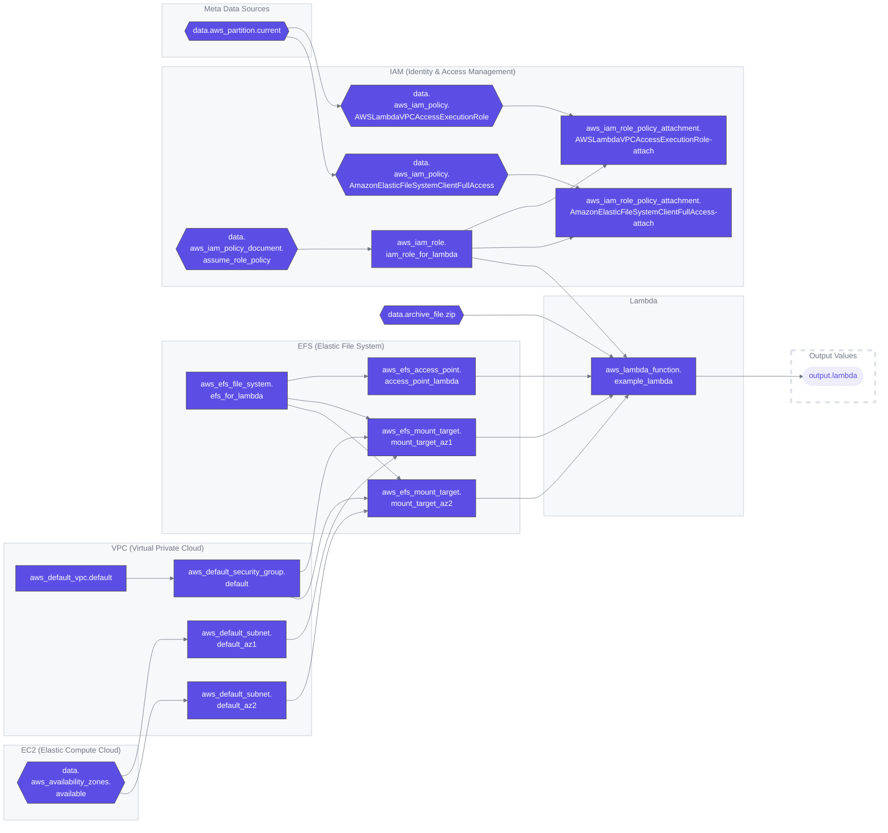

### [terraform-provider-aws/examples/networking](https://github.com/hashicorp/terraform-provider-aws/tree/main/examples/networking)

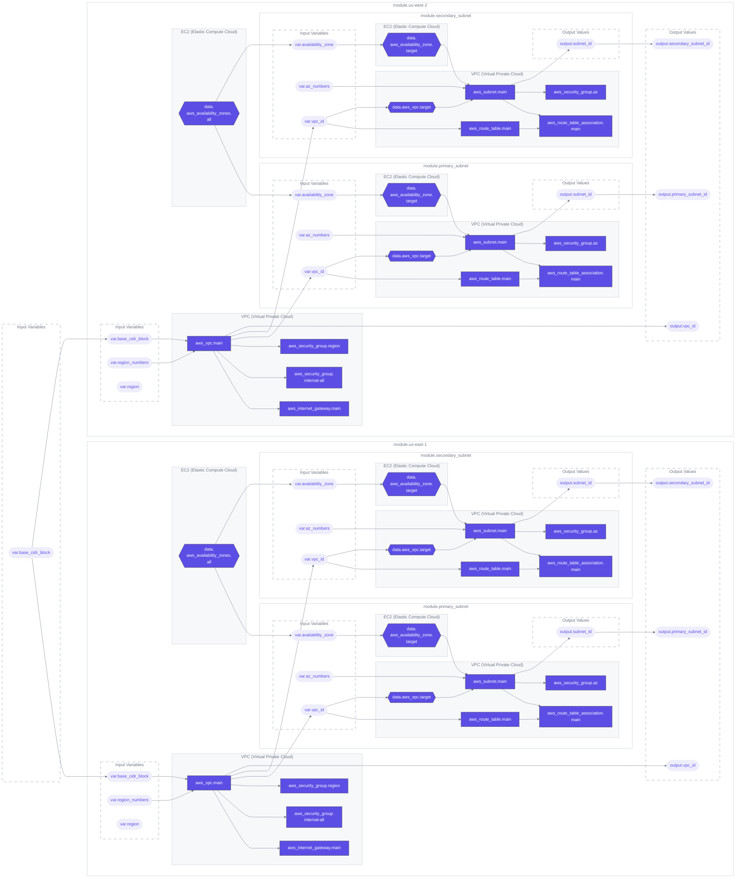

### [terraform-provider-aws/examples/rds](https://github.com/hashicorp/terraform-provider-aws/tree/main/examples/rds)

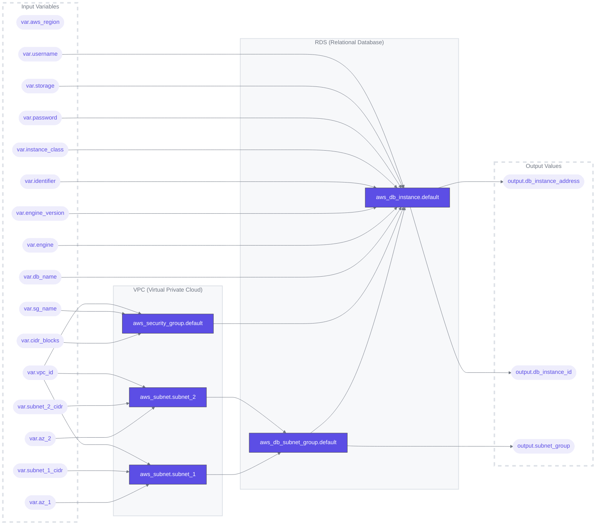

### [terraform-provider-aws/examples/s3-api-gateway-integration](https://github.com/hashicorp/terraform-provider-aws/tree/main/examples/s3-api-gateway-integration)

```yaml
- uses: asannou/tfmermaid-action@v1
  with:
    exclude: _orphan
```

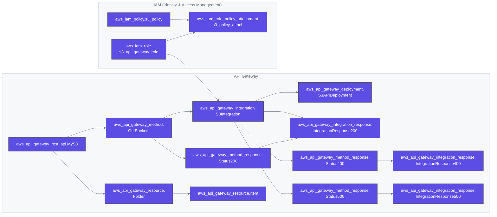

### [terraform-provider-aws/examples/s3-cross-account-access](https://github.com/hashicorp/terraform-provider-aws/tree/main/examples/s3-cross-account-access)

```yaml
- uses: asannou/tfmermaid-action@v1
  with:
    include: provider
```

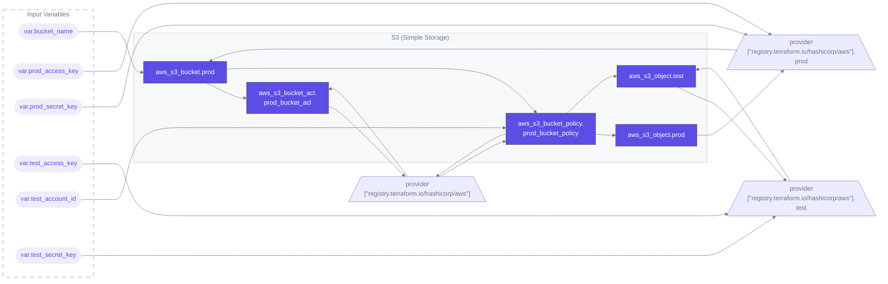

### [terraform-provider-aws/examples/sagemaker](https://github.com/hashicorp/terraform-provider-aws/tree/main/examples/sagemaker)

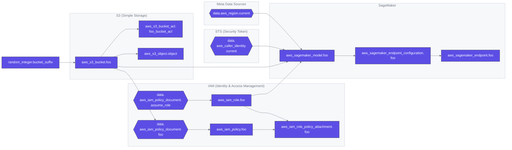

### [terraform-provider-aws/examples/transit-gateway-cross-account-peering-attachment](https://github.com/hashicorp/terraform-provider-aws/tree/main/examples/transit-gateway-cross-account-peering-attachment)

```yaml
- uses: asannou/tfmermaid-action@v1
  with:
    include: provider
```

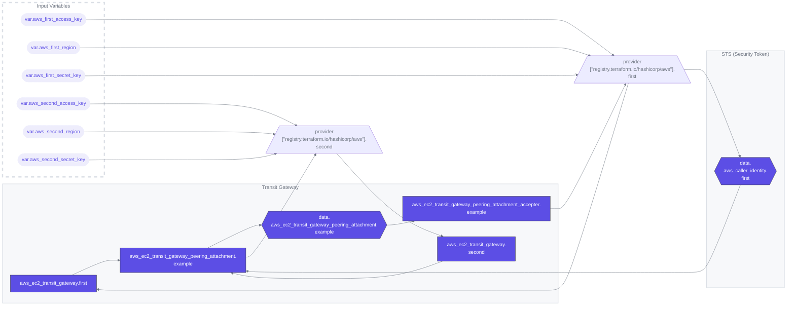

### [terraform-provider-aws/examples/workspaces](https://github.com/hashicorp/terraform-provider-aws/tree/main/examples/workspaces)

```yaml
- uses: asannou/tfmermaid-action@v1
  with:
    exclude: _orphan
```

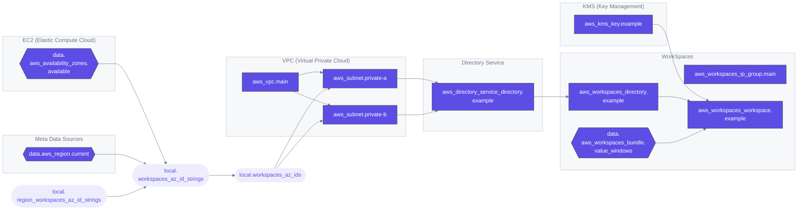

### [terraform-provider-google/examples/cloud-armor](https://github.com/hashicorp/terraform-provider-google/tree/main/examples/cloud-armor)

```yaml
- uses: asannou/tfmermaid-action@v1
  with:
    include: provider
```

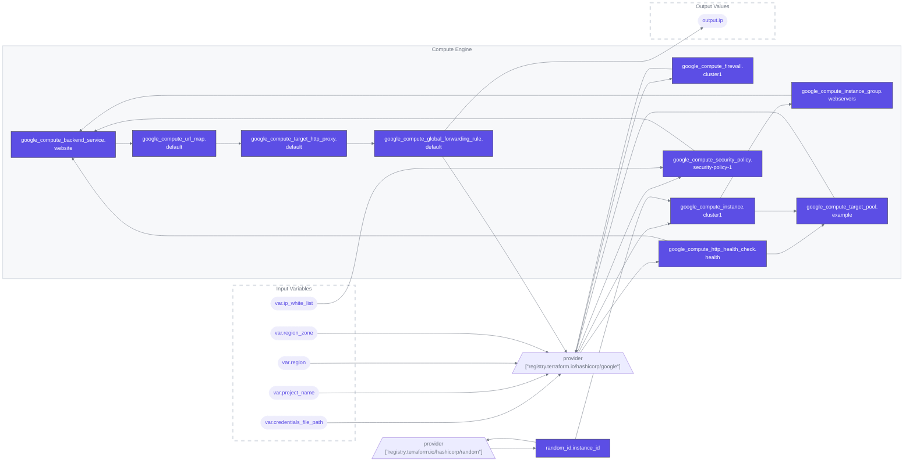

### [terraform-provider-google/examples/content-based-load-balancing](https://github.com/hashicorp/terraform-provider-google/tree/main/examples/content-based-load-balancing)

```yaml
- uses: asannou/tfmermaid-action@v1
  with:
    orientation: TB
    include: provider
```

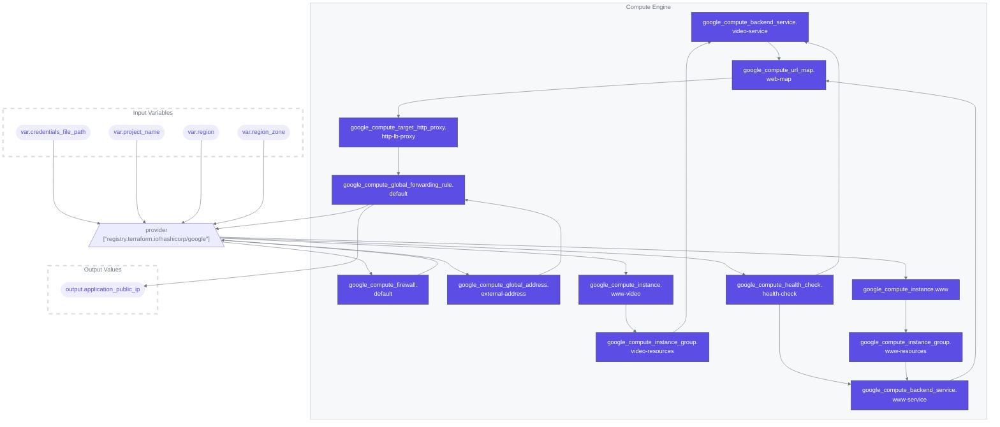

### [terraform-provider-google/examples/endpoints-on-compute-engine](https://github.com/hashicorp/terraform-provider-google/tree/main/examples/endpoints-on-compute-engine)

```yaml
- uses: asannou/tfmermaid-action@v1
  with:
    include: provider
```

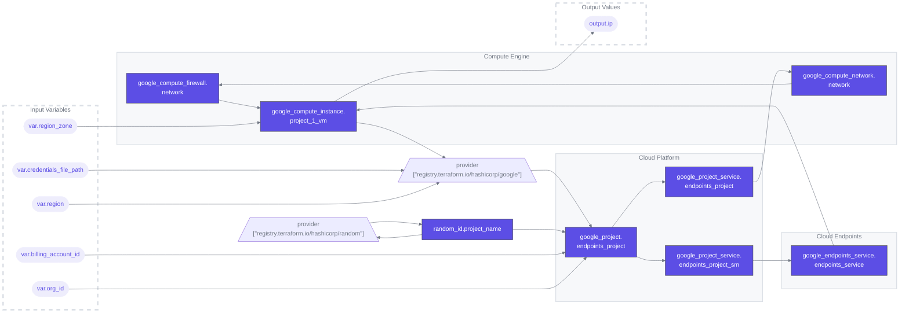

### [terraform-provider-azurerm/examples/api-management](https://github.com/hashicorp/terraform-provider-azurerm/tree/main/examples/api-management)

```yaml
- uses: asannou/tfmermaid-action@v1
  with:
    orientation: TB
```

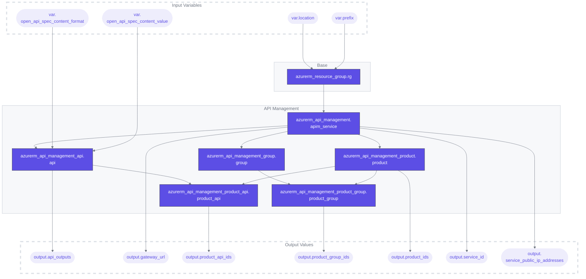

### [terraform-provider-azurerm/examples/recovery-services/virtual-machine](https://github.com/hashicorp/terraform-provider-azurerm/tree/main/examples/recovery-services/virtual-machine)

```mermaid
%%tfmermaid:terraform-provider-azurerm/examples/recovery-services/virtual-machine
%%{init:{"theme":"default","themeVariables":{"lineColor":"#6f7682","textColor":"#6f7682"}}}%%
flowchart LR
classDef r fill:#5c4ee5,stroke:#444,color:#fff
classDef v fill:#eeedfc,stroke:#eeedfc,color:#5c4ee5
classDef ms fill:none,stroke:#dce0e6,stroke-width:2px
classDef vs fill:none,stroke:#dce0e6,stroke-width:4px,stroke-dasharray:10
classDef ps fill:none,stroke:none
classDef cs fill:#f7f8fa,stroke:#dce0e6,stroke-width:2px
subgraph "n0"["Recovery Services"]
n1["azurerm_backup_policy_vm.<br/>example"]:::r
n2["azurerm_backup_protected_vm.<br/>example"]:::r
n3["azurerm_recovery_services_vault.<br/>example"]:::r
end
class n0 cs
subgraph "n4"["Base"]
n5["azurerm_resource_group.<br/>example"]:::r
end
class n4 cs
subgraph "n6"["module.virtual-machine"]
subgraph "n6_padding"[" "]
subgraph "n7"["Network"]
n8["azurerm_network_interface.<br/>example"]:::r
end
class n7 cs
subgraph "n9"["Compute"]
na["azurerm_virtual_machine.<br/>example"]:::r
end
class n9 cs
subgraph "nb"["Base"]
nc{{"data.<br/>azurerm_resource_group.<br/>example"}}:::r
end
class nb cs
subgraph "nd"["Output Values"]
ne(["output.id"]):::v
end
class nd vs
subgraph "nf"["Input Variables"]
ng(["var.prefix"]):::v
nh(["var.subnet_id"]):::v
ni(["var.resource_group_name"]):::v
end
class nf vs
end
class n6_padding ps
end
class n6 ms
subgraph "nj"["module.virtual-network"]
subgraph "nj_padding"[" "]
subgraph "nk"["Network"]
nl["azurerm_subnet.example"]:::r
nm["azurerm_virtual_network.<br/>example"]:::r
end
class nk cs
subgraph "nn"["Base"]
no{{"data.<br/>azurerm_resource_group.<br/>example"}}:::r
end
class nn cs
subgraph "np"["Output Values"]
nq(["output.subnet_id"]):::v
end
class np vs
subgraph "nr"["Input Variables"]
ns(["var.prefix"]):::v
nt(["var.resource_group_name"]):::v
end
class nr vs
end
class nj_padding ps
end
class nj ms
subgraph "nu"["Input Variables"]
nv(["var.location"]):::v
nw(["var.prefix"]):::v
end
class nu vs
n3-->n1
n1-->n2
ne-->n2
n5-->n3
nv--->n5
nw--->n5
nc-->n8
ng-->n8
nh-->n8
n8-->na
ni-->nc
na-->ne
nw--->ng
n5-->ni
nq-->nh
nm-->nl
no-->nm
ns-->nm
nt-->no
nl-->nq
nw--->ns
n5-->nt
```

### [terraform-provider-azurerm/examples/traffic-manager/vm-scale-set](https://github.com/hashicorp/terraform-provider-azurerm/tree/main/examples/traffic-manager/vm-scale-set)

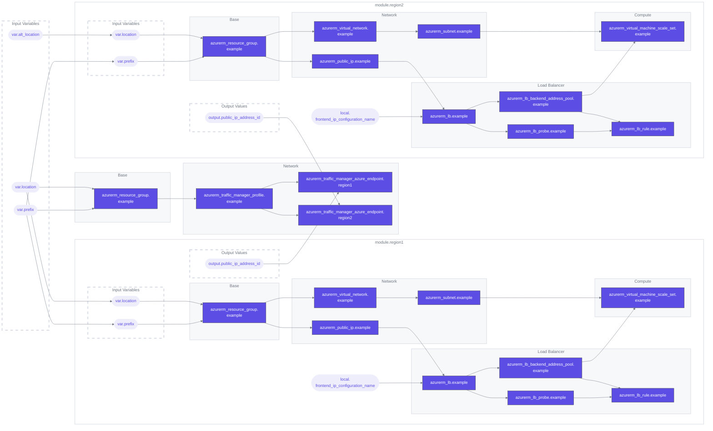

